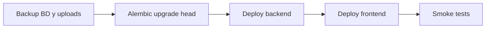

# Guía de despliegue — Optimización Horizonte 1

Esta guía describe cómo publicar en producción (o staging) los cambios de **búsqueda paginada en servidor**, **listado liviano**, **índices en BD** y **normalización de `fecha_visita`**, sin sorpresas en operación.

## Resumen de lo que cambia

| Área | Antes | Después |
|------|--------|---------|
| Listado diligenciados | `GET /api/v1/forms/?limit=500` (JSON completo) | `GET /api/v1/forms/search` (resumen + filtros + paginación) |
| Detalle de un formulario | Datos ya venían en el listado | `GET /api/v1/forms/{id}` al expandir la fila (lazy loading) |
| Sección **Datos** | Agregaciones en `/stats` | **Sin cambio** (sigue siendo la vía correcta para reportes globales) |
| Persistencia | `fecha_visita` podía quedar en formatos mixtos | Se normaliza a `YYYY-MM-DD` al guardar en servidor |
| Base de datos | Sin índice explícito en `fecha_hora` (orden del listado) | Migración `20260603_0003` |

## Orden recomendado de despliegue



1. **Backup** (opcional pero recomendado en producción).
2. **Migración Alembic** (antes o junto con el backend nuevo).
3. **Backend** (debe exponer `/api/v1/forms/search` antes de que el frontend nuevo llegue a usuarios).
4. **Frontend** (PWA; los usuarios pueden necesitar recarga forzada para ver el bundle nuevo).
5. **Smoke tests** (checklist al final).

> **Compatibilidad:** El endpoint antiguo `GET /api/v1/forms/` sigue existiendo. Si desplegás solo backend primero, el frontend viejo sigue funcionando (con el límite de 500). El frontend nuevo **requiere** el endpoint `/search`.

---

## 1. Pre-despliegue

### Requisitos

- Código con la migración: `backend/alembic/versions/20260603_0003_add_forms_lookup_indexes.py`
- `AUTO_CREATE_SCHEMA=false` en producción (usar Alembic, no creación automática de tablas).
- Token JWT válido para probar la API.

### Backup (producción)

```bash
# Ejemplo: backup de Postgres (ajustar usuario/host según tu compose)
docker compose exec nosignal-survey-db pg_dump -U nosignal_survey nosignal_survey > backup_pre_horizonte1_$(date +%Y%m%d).sql
```

Si usás el script del repo, ver también [scripts/README-backups.md](../scripts/README-backups.md).

### Verificación local (opcional)

```bash
cd backend
pytest tests/test_api_endpoints.py tests/test_persist_form_update.py
```

```bash
cd frontend
npm run typecheck
npm run test -- src/services/api.test.ts src/pages/FormulariosDiligenciadosPage.bulkDelete.test.tsx
npm run build
```

---

## 2. Migración de base de datos

Revisión: `20260603_0003` — índices de consulta.

- `ix_forms_fecha_hora_desc` en `forms (fecha_hora DESC)`
- `ix_forms_id_perfil_encuestador` (idempotente si ya existía por migración anterior)

### Docker (mismo flujo que README principal)

Tras `git pull` que incluya migraciones, **reconstruir la imagen del backend** (las migraciones van dentro de la imagen):

```bash
docker compose build backend
docker compose up -d backend
docker compose exec backend python -m alembic upgrade head
```

Comprobar revisión actual:

```bash
docker compose exec backend python -m alembic current
```

Debe mostrar `20260603_0003` (o `head`).

### Backend fuera de Docker

```bash
cd backend
# Con DATABASE_URL apuntando a la BD correcta
python -m alembic upgrade head
```

### Si la migración falla

- Revisar logs de Alembic y conexión (`DATABASE_URL` / `SURVEY_DATABASE_URL`).
- No desplegar el frontend nuevo hasta tener backend + BD alineados.
- Los índices usan `CREATE INDEX IF NOT EXISTS`; en la mayoría de casos un reintento tras corregir conexión es seguro.

---

## 3. Despliegue del backend

```bash
docker compose build backend
docker compose up -d backend
```

### Comprobación rápida de API

Sustituir `TOKEN` y la URL base (`https://api.survey.nosignal.site` o la que uses).

**Health:**

```bash
curl -s https://api.survey.nosignal.site/health
```

**Búsqueda (requiere JWT):**

```bash
curl -s -H "Authorization: Bearer TOKEN" \
  "https://api.survey.nosignal.site/api/v1/forms/search?limit=5&offset=0"
```

Respuesta esperada (estructura):

```json
{
  "items": [ { "id_formulario": "...", "nombres_apellidos_encuestado": "...", ... } ],
  "total": 123,
  "limit": 5,
  "offset": 0
}
```

**Detalle por id (ya usado por lazy loading):**

```bash
curl -s -H "Authorization: Bearer TOKEN" \
  "https://api.survey.nosignal.site/api/v1/forms/ID_FORMULARIO"
```

**Filtros de búsqueda:**

```bash
curl -s -H "Authorization: Bearer TOKEN" \
  "https://api.survey.nosignal.site/api/v1/forms/search?limit=20&offset=0&q=ana&municipio=Popayan&fecha_desde=2025-01-01&fecha_hasta=2025-12-31"
```

---

## 4. Despliegue del frontend

```bash
docker compose build frontend
docker compose up -d frontend
```

### PWA y caché

Los usuarios con la app instalada pueden seguir viendo un bundle antiguo hasta que:

- Recarguen la página (en móvil: cerrar pestaña y volver a abrir), o
- El service worker actualice (según configuración de Workbox).

Para validar en campo, pedir **recarga forzada** tras el despliegue si algo no cuadra con `/search`.

---

## 5. Smoke tests en la aplicación

Marcar cada ítem tras desplegar en el entorno objetivo.

### Formularios diligenciados

- [ ] Con sesión y red: la lista carga sin error (petición a `/api/v1/forms/search`).
- [ ] Filtro por **nombre del encuestado**: resultados acotados en servidor (no solo sobre los últimos 500).
- [ ] Filtro por **municipio** y **rango de fechas**: encuentra un formulario **antiguo** que antes no aparecía en el top 500.
- [ ] Botón **Cargar más**: aparece cuando `total > items cargados`; al pulsarlo aumenta el listado.
- [ ] Al abrir **Ver formulario** en una fila del servidor: carga detalle (llamada a `GET /forms/{id}`) y fotos.
- [ ] **Offline**: sin red, siguen visibles precargas y cola PENDIENTE/ERROR según comportamiento previo.
- [ ] Contador de servidor (si se muestra): refleja `total` de búsqueda cuando hay listado remoto.

### Sección Datos (sin regresión)

- [ ] Gráficos y totales cargan con filtros de municipio y fechas.
- [ ] Los números siguen siendo coherentes con formularios ya sincronizados (no dependen del listado paginado).

### Persistencia nueva

- [ ] Enviar o editar un formulario con `fecha_visita` en formato `DD/MM/YYYY`: en BD queda `YYYY-MM-DD` (verificar un registro de prueba).

### Regresión API antigua

- [ ] `GET /api/v1/forms/?limit=10` sigue respondiendo (por si hay integraciones externas).

---

## 6. Monitoreo post-despliegue (primeras 48 h)

- Tamaño y tiempo de respuesta de `GET /forms/search` (debe ser mucho menor que el listado completo anterior).
- Errores `401` / `forms_search_*` en logs del backend.
- Quejas de “no encuentro un formulario viejo” → comprobar que usan filtros de fecha o **Cargar más**, no solo scroll del listado por defecto.

---

## 7. Rollback (si hace falta)

| Componente | Acción |
|------------|--------|
| Frontend | Volver a imagen/commit anterior; el backend viejo sin `/search` rompe el listado nuevo → desplegar frontend y backend juntos al revertir. |
| Backend | Imagen anterior; `GET /forms/` sigue disponible para clientes viejos. |
| Migración BD | Los índices añadidos son seguros dejar; **no es obligatorio** hacer `downgrade` salvo política interna. Si hacés downgrade: `alembic downgrade 20260529_0002` elimina `ix_forms_fecha_hora_desc`. |

---

## 8. Archivos tocados (referencia)

| Archivo | Rol |
|---------|-----|
| `backend/app/api/v1/forms.py` | Ruta `GET /search` |
| `backend/app/repository/forms.py` | `search_forms_summary` |
| `backend/app/schemas/form_read.py` | `FormSummaryItem`, `FormSearchResponse` |
| `backend/app/services/forms.py` | Normalización `fecha_visita` |
| `backend/alembic/versions/20260603_0003_add_forms_lookup_indexes.py` | Índices |
| `frontend/src/services/api.ts` | `searchFormsFromApi` |
| `frontend/src/pages/FormulariosDiligenciadosPage.tsx` | Búsqueda, paginación, lazy detail |

---

## Contacto operativo

Si tras el despliegue un formulario **existe en Datos** (stats) pero **no aparece en diligenciados**, revisar:

1. Filtros activos en la UI (nombre, municipio, fechas).
2. Si hace falta **Cargar más** (paginación).
3. Formato de `fecha_visita` en registros muy antiguos (solo afecta filtro por rango hasta que se re-guarden o se normalicen en backfill manual).

La sección **Datos** no usa el listado paginado; para reportes globales seguir usando esa pantalla.
